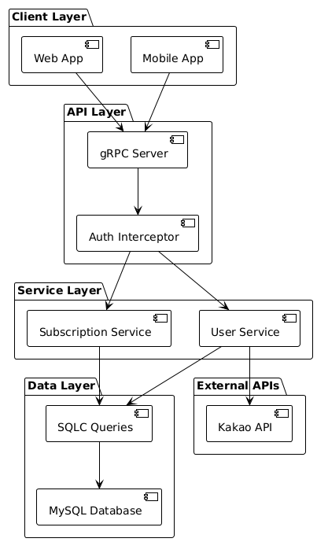
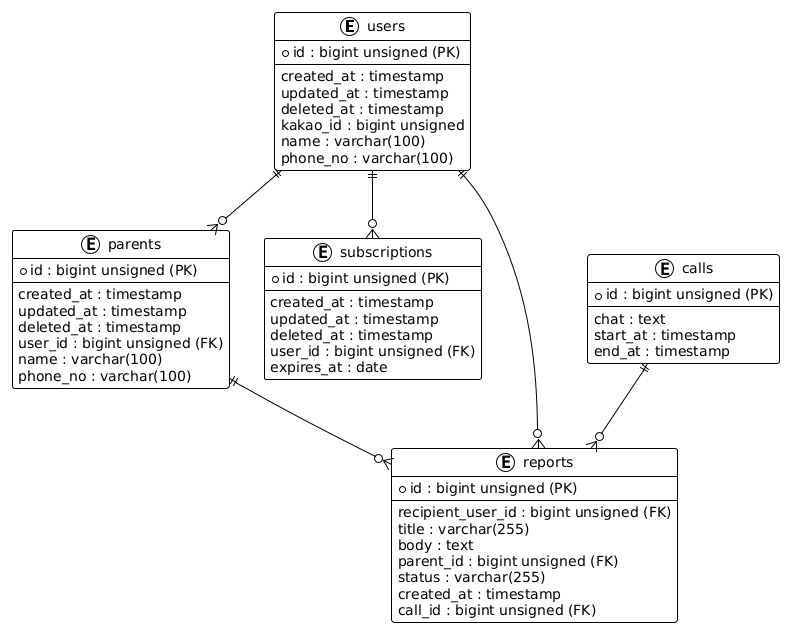

# Care-Go

효도의 정석 서비스를 위한 gRPC 기반 백엔드 서버

## 프로젝트 개요

**Care-Go**는 효도의 정석 서비스의 백엔드 API 서버입니다. 카카오 소셜 로그인과 구독 관리 기능을 제공하며, gRPC 프로토콜을 사용하여 클라이언트와 통신합니다.

## 기술 스택

- **Language**: Go 1.21
- **Protocol**: gRPC
- **Database**: MySQL
- **ORM**: SQLC (SQL Code Generator)
- **Authentication**: JWT + Kakao OAuth
- **Containerization**: Docker

## 아키텍처



## 주요 기능

### 1. 사용자 관리 (User Service)
- 카카오 OAuth를 통한 사용자 인증
- JWT 토큰 발급 및 관리
- 사용자 정보 CRUD 작업

### 2. 구독 관리 (Subscription Service)
- 사용자 구독 생성 및 조회
- 구독 만료일 관리

### 3. 인증 시스템
- JWT 기반 인증
- gRPC 인터셉터를 통한 요청 인증
- 카카오 액세스 토큰 검증

## 데이터베이스 스키마



## gRPC 서비스 정의

### UserService
```protobuf
service UserService {
  rpc GetUser(google.protobuf.Empty) returns (User) {}
  rpc CreateUser(CreateUserRequest) returns (User) {}
  rpc UpdateUser(UpdateUserRequest) returns (User) {}
  rpc DeleteUser(DeleteUserRequest) returns (google.protobuf.Empty) {}
  rpc GetUserByKakaoAccessToken(GetUserByKakaoAccessTokenRequest) returns (User) {}
  rpc GetJWTByAccessToken(GetJWTByAccessTokenRequest) returns (JWT) {}
}
```

### SubscriptionService
```protobuf
service SubscriptionService {
  rpc GetSubscriptions(google.protobuf.Empty) returns (SubscriptionList) {}
  rpc CreateSubscription(SubscriptionCreateRequest) returns (Subscription) {}
}
```

## 프로젝트 구조

```
care-go/
├── cmd/
│   └── server/
│       └── main.go              # 서버 엔트리포인트
├── db/
│   ├── gen/                     # SQLC 생성 파일
│   ├── queries/                 # SQL 쿼리 파일
│   ├── schema/                  # 데이터베이스 스키마
│   └── sqlc.yaml               # SQLC 설정
├── internal/
│   ├── auth/                    # JWT 인증 관리
│   ├── interceptors/            # gRPC 인터셉터
│   ├── pb/                      # 생성된 프로토콜 버퍼 파일
│   ├── protos/                  # 프로토콜 버퍼 정의
│   ├── server/                  # 서비스 구현
│   └── utils/                   # 유틸리티 함수
├── docker-compose.yml           # 개발 환경 설정
├── Dockerfile                   # 컨테이너 빌드 설정
└── proto-gen.sh                # 프로토콜 버퍼 생성 스크립트
```

## 개발 환경 설정

### Prerequisites
- Go 1.21+
- MySQL 8.0+
- Protocol Buffers Compiler (protoc)
- Docker (선택사항)

### 설치 및 실행

1. **리포지토리 클론**
```bash
git clone https://github.com/sjwhole/care-go.git
cd care-go
```

2. **의존성 설치**
```bash
go mod download
```

3. **데이터베이스 설정**
```bash
# MySQL 서버 시작
mysql -u root -p

# 데이터베이스 생성
CREATE DATABASE care;

# 스키마 적용
source db/schema/schema.sql
```

4. **프로토콜 버퍼 생성**
```bash
./proto-gen.sh
```

5. **서버 빌드 및 실행**
```bash
go build cmd/server/main.go
./main
```

### Docker를 사용한 개발 환경

```bash
docker-compose up -d
```

## Flutter 클라이언트 연동

### 프론트엔드 프로젝트
- **리포지토리**: [care-flutter](https://github.com/sjwhole/care-flutter)
- **기술 스택**: Flutter, Dart, gRPC, Kakao SDK

### Flutter에서 gRPC 클라이언트 구현

#### 1. 의존성 설정
```yaml
dependencies:
  grpc: ^3.2.4
  protobuf: ^3.1.0
  kakao_flutter_sdk_user: ^1.8.0
  flutter_secure_storage: ^9.0.0
  provider: ^6.1.1
```

#### 2. gRPC 채널 설정
```dart
// lib/grpc/channel.dart
import 'package:grpc/grpc.dart';

final channel = ClientChannel(
  '192.168.30.3',
  port: 50051,
  options: const ChannelOptions(
    credentials: ChannelCredentials.insecure(),
  ),
);
```

#### 3. JWT 인터셉터 구현
```dart
// lib/grpc/services/user_service.dart
class JwtInterceptor extends ClientInterceptor {
  JwtInterceptor(this.jwt);
  
  final String? jwt;
  
  Future<void> _injectToken(Map<String, String> metadata, String uri) async {
    metadata['jwt'] = jwt ?? "";
  }

  @override
  ResponseFuture<R> interceptUnary<Q, R>(ClientMethod<Q, R> method, Q request,
      CallOptions options, ClientUnaryInvoker<Q, R> invoker) {
    final modifiedOptions = options.mergedWith(
      CallOptions(
        providers: [_injectToken],
      ),
    );
    return super.interceptUnary(method, request, modifiedOptions, invoker);
  }
}
```

#### 4. User Service 클라이언트 구현
```dart
class UserService {
  UserService(this.jwt);

  final String? jwt;
  late UserServiceClient stub = UserServiceClient(
    channel, 
    interceptors: [JwtInterceptor(jwt)]
  );

  Future<User> getUser() async {
    try {
      var response = await stub.getUser(Empty());
      return response;
    } on GrpcError catch (e) {
      print('Error: $e');
      return User(name: "???");
    }
  }

  Future<String> getJWTByKakaoAccessToken(String accessToken) async {
    try {
      var response = await stub.getJWTByAccessToken(
        GetJWTByAccessTokenRequest()..kakaoAccessToken = accessToken
      );
      return response.jwt;
    } on GrpcError catch (e) {
      if (e.codeName == "NOT_FOUND") {
        // 신규 사용자 생성
        await stub.createUser(
          CreateUserRequest()..kakaoAccessToken = accessToken
        );
      }
      return "";
    }
  }
}
```

#### 5. 카카오 로그인 연동
```dart
// lib/widgets/login_with_kakao_widget.dart
Future<void> _loginWithKakao(BuildContext context) async {
  try {
    OAuthToken token = await UserApi.instance.loginWithKakaoTalk();
    
    final jwtProvider = Provider.of<JwtProvider>(context, listen: false);
    var newJwt = await jwtProvider.userService
        .getJWTByKakaoAccessToken(token.accessToken);
    
    jwtProvider.jwt = newJwt;
    
    // 사용자 정보 획득
    User user = await UserApi.instance.me();
    print('로그인 성공: ${user.kakaoAccount?.name}');
    
  } catch (error) {
    print('카카오 로그인 실패: $error');
  }
}
```

#### 6. JWT 상태 관리
```dart
// lib/providers/jwt_provider.dart
class JwtProvider extends ChangeNotifier {
  String? _jwt;
  
  String? get jwt => _jwt;
  late UserService _userService = UserService(_jwt);
  UserService get userService => _userService;

  set jwt(String? newJwt) {
    _jwt = newJwt;
    _userService = UserService(_jwt);
    notifyListeners();
  }

  JwtProvider(this._jwt);
}
```

### 클라이언트 사용 흐름

1. **카카오 로그인**: 사용자가 카카오 계정으로 로그인
2. **JWT 획득**: 카카오 액세스 토큰을 통해 백엔드에서 JWT 토큰 획득
3. **인증된 API 호출**: JWT 토큰을 사용하여 gRPC 서비스 호출
4. **상태 관리**: Provider 패턴을 통한 JWT 상태 관리

## API 사용 예시

### 1. 카카오 로그인으로 사용자 생성
```bash
grpcurl -plaintext -d '{
  "kakaoAccessToken": "your_kakao_access_token"
}' localhost:50051 user.UserService/CreateUser
```

### 2. JWT 토큰으로 사용자 정보 조회
```bash
grpcurl -plaintext -H "authorization: Bearer your_jwt_token" \
  localhost:50051 user.UserService/GetUser
```

### 3. 구독 생성
```bash
grpcurl -plaintext -H "authorization: Bearer your_jwt_token" -d '{
  "userId": "1",
  "expiresAt": "2024-12-31T23:59:59Z"
}' localhost:50051 subscription.SubscriptionService/CreateSubscription
```

